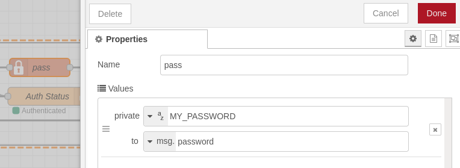

# OBS Websoket Authentication in Node-RED

This flow allows you to securize your communication between Node-RED and OBS Websocket.

Authentication with OBS Websocket is a bit messy. You need a specific flow to establish a secure channel. 
It is not really intuitive and took me a few hours to understand and implement.
This flow is the result.

## Installation
### OBS Setup
First, you need to activate authentication in OBS Websocket :
1. In OBS : Tools Menu > Websocket Server Settings
2. Check "Enable authentication" and add a password

### Node-RED Setup
To ensure a good security, you're going to need the "node-red-contrib-credentials" palette.
1. Open Menu > Manage palette
2. Search for "node-red-contrib-credentials" and install

Then, copy the content from the flow.json file in this repository and import it in Node-RED :
1. Open Menu > Import
2. Copy/Paste the content of the JSON file above
3. You should end up with this :

4. Triple click on the "pass" node to open its settings and put the password you created in the OBS setup in the "private" field:

 
Restart all your flows. After a few seconds, you should see "Authenticated" under the "Auth Status" node.
 
#### Important note
If OBS is started after Node-RED, you will not be authenticated automatically. 
A button is provided in the flow to trigger a new authentication.
A fallback flow is also provided but the first message than you send will not be accepted by OBS.
